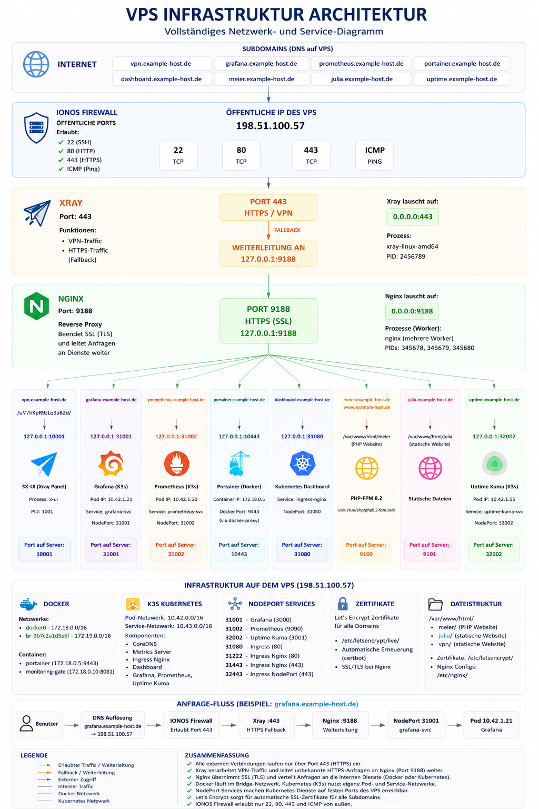

# Hallo, ich bin Dzamal Barambajev 👋
### Fachinformatiker für Systemintegration (IHK) | DevOps & Cloud Enthusiast | Wohnhaft in Deutschland 🇩🇪
### 🎯 Ziel des Projekts 
➜ Aufbau einer zentral verwalteten Self-Hosted-Cloud-Plattform, auf der Infrastruktur, Monitoring, Sicherheit und Anwendungen durch standardisierte und automatisierte Prozesse bereitgestellt und verwaltet werden können.

### Der Ursprung des Projekts war ein privater VPN-Dienst🌍
Ausgehend von einem privaten Familien-VPN entwickelte sich dieses Projekt zu einer mehrschichtigen Self-Hosted-Cloud-Plattform mit Kubernetes, Monitoring, Reverse-Proxy-Routing und Infrastruktur-Automatisierung.

## ☁️ Dzamal Cloud Platform

---

🌐 VPN ➜ 🔒 Security ➜ 🚦 Nginx Reverse Proxy ➜ 📊 Monitoring ➜ ☸️ Kubernetes ➜ ⚙️ Automation

Aktuelle Entwicklungsbereiche:

✅ Security Hardening & Stealth Networking

✅ Kubernetes (K3s)

✅ Grafana, Prometheus & Observability

✅ Infrastructure as Code (Ansible)

✅ Persistent Storage

✅ Reverse Proxy & Service Routing

### 🚀 Aktueller Plattform-Stand (11 Juni 2026)

- 🚧 **Aktueller Schwerpunkt:** Migration von Docker-Workloads nach Kubernetes (K3s) und Aufbau einer Ansible-basierten Infrastrukturautomatisierung.

- ☸️ **Kubernetes Migration:** Erfolgreiche Migration zentraler Monitoring-Dienste in das K3s-Cluster
  (Grafana, Prometheus und Uptime Kuma)

- 📊 **Observability Stack:** Grafana, Prometheus, Node Exporter, kube-state-metrics, Kubernetes Metrics Server und Alerting

- 🔐 **Security & Routing:** Xray Reality, Nginx Reverse Proxy, Single-Exposed-Port-Architektur und Security Hardening

---

---

## 🚀 Wichtigste Infrastruktur-Erfolge

☸️ Kubernetes & Cloud-Native Engineering

    K3s Cluster Plattform:
    Aufbau und Betrieb einer Kubernetes-Infrastruktur auf einem produktiven Ubuntu VPS.

    Service Migration:
    Migration zentraler Monitoring-Dienste (Grafana, Prometheus und Uptime Kuma) von Docker in Kubernetes.

    Ingress Architektur:
    Betrieb eines zentralen Ingress-Nginx Controllers für Routing, TLS-Termination und Service-Publikation.

    Kubernetes Monitoring:
    Integration von Metrics Server und kube-state-metrics für Cluster-, Node- und Pod-Metriken.

    Persistente Datenhaltung:
    Nutzung von Persistent Volumes (PVC) und Local Path Provisioning für zustandsbehaftete Anwendungen.

### 🔒 Stealth Networking & Traffic-Verschleierung
* **Xray Reality Edge Gateway:** Implementierung eines Edge-Routing-Kerns mit **Xray (VLESS-Reality)** auf Port 443. Konfiguration von Stealth-Handshakes, die legitime Web-Ziele imitieren, um eine lückenlose Traffic-Verschleierung zu gewährleisten.
* **Intelligentes Fallback-Routing:** Entwicklung maßgeschneiderter **Fallback-Pfade** innerhalb des Xray-Kerns. Nicht authentifizierter, allgemeiner Web-Traffic auf Port 443 wird nahtlos an einen internen Port (`8443`) weitergeleitet, wodurch die Existenz des VPN-Gateways vollständig verborgen bleibt.
* **Internes Reverse-Proxying:** Konfiguration einer internen **Nginx-Isolationsschicht** auf Port 8443 zum sicheren Multiplexen und Hosten von Websites, Verwaltungsoberflächen und interne Dienste (Produktions-Landingpages und PHP-Familienanwendungen) hinter dem Xray-Perimeter.
* **Automatisiertes SSL-Management:** Erstellung automatisierter Certbot-Lifecycle-Trigger (`pre_hook` / `post_hook`) zur Koordinierung kurzzeitiger Nginx-Freigaben, wodurch ein ausfallfreies Erneuerungsfenster für Zertifikate (Zero-Downtime) gewahrt bleibt.

### 📊 Observability & Storage-Isolation (GitOps Native)
* **Hochkapazitive Speichererweiterung:** Partitionierung, Formatierung und Einbindung eines dedizierten **externen 100 GB Block-Storage-Laufwerks (`/dev/vdb1` -> `/mnt/storage`)**, um zu verhindern, dass persistente Observability-Logs den primären System-Speicher überlasten.
* **Cloud-Native Observability Stack:** Migration zentraler Monitoring-Dienste (Grafana, Prometheus und Uptime Kuma) in ein Kubernetes (K3s) Cluster mit Persistent Volumes und Ingress Routing.
* **📈 Monitoring-Datenmanagement:** Implementierung einer kontrollierten Datenaufbewahrung innerhalb von Prometheus, um langfristige Metriktrends zu erfassen und gleichzeitig den Speicherverbrauch vorhersehbar zu halten.
* **Service Availability Monitoring:** Betrieb von Uptime Kuma innerhalb des Kubernetes Clusters zur kontinuierlichen Überwachung von Infrastruktur-, Web- und Routing-Diensten.

### ⚙️ Systems Engineering & IaC-Automatisierung
* **Infrastructure as Code (Ansible Automation):** Entwicklung eines umgebungsbewussten Infrastructure-as-Code (IaC) Repositories. Implementierung einer adaptiven `hosts`-Matrix zur Handhabung unabhängiger SSH-Schlüssel (`id_ed25519_wsl`) und Python-Kompilierungspfade, basierend auf der jeweiligen Workstation (Debian Laptop vs. Windows/WSL2).
* **Automatisierte Disaster Recovery:** Programmierung geplanter Root-Cronjobs, die nächtliche Datenbank-Dumps, System-Image-Archivierungen und verschlüsselte Synchronisierungsprotokolle ausführen, um Backups direkt in verschlüsselte Externe-Backup-Speicherorte zu streamen.

---

## 🧰 Tech Stack & Tools

* **Betriebssysteme:** Linux (Ubuntu Server, Debian GNU/Linux), WSL2 (Windows Subsystem for Linux)
* **Kubernetes:** K3s, Ingress-Nginx, CoreDNS, Metrics Server, kube-state-metrics
* **Traffic-Verschleierung:** Xray Core (VLESS, REALITY, Fallback), X-UI Framework
* **Automatisierung & IaC:** Ansible, Cronjobs, Bash
* **Containerisierung:** Kubernetes, Docker, Docker Compose, Portainer
* **Web-Dienste:** Nginx (Interner Reverse Proxy), PHP, Certbot (ACME)
* **Observability:** Prometheus, Grafana, Uptime Kuma
* **Versionsverwaltung:** Git, GitHub (GitOps Token-Architektur)
* **Zertifikatsmanagement:** Certbot, Let's Encrypt
* **Storage:** PVC, Local Path Provisioner, Block Storage 

### 🖥️ Live Infrastructure Dashboards

📊 Klicken zum Ausklappen: Grafana Monitoring Dashboard

   

    

🔮 Klicken zum Ausklappen: Xray VPN Control Panel

   

    

## 🏗️ Architektur-Galerie

### 🚀 Neu Lab (12 Juni 2026)

